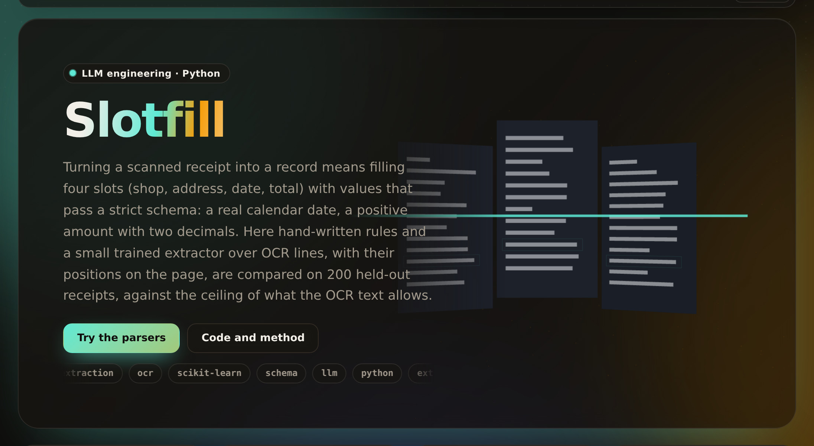

# slotfill

[](https://github.com/umer-78/slotfill/actions/workflows/ci.yml)

[](https://umer-78.github.io/slotfill/)

**Live demo:** https://umer-78.github.io/slotfill/ (rules against the trained extractor field by field, and the schema's parsers to try)

Can a small trained model hold a strict extraction schema at a fraction of a frontier model's cost?

The spec's documents are freight invoices, which are private. The closest public stand-in is SROIE (ICDAR 2019): 626 real scanned receipts from hundreds of shops, each with its OCR'd text and labelled company, date, address and total. It is the same job: a fixed schema out of noisy, varied layouts.

## Results

`python -m slotfill bench` (about 20 seconds). There are 200 held-out receipts that never touch training, and 426 for training.

| Extractor | Schema-valid | Company | Date | Address | Total | All four right | p95 latency | Cost per 1,000 |
|---|---|---|---|---|---|---|---|---|
| rules (hand-written baseline) | 83.5% | 60.5% | 97.0% | 31.5% | 69.0% | 13.0% | 0.2 ms | $0.000003 |
| trained, 100 receipts | 98.5% | 63.5% | 98.0% | 59.0% | 86.0% | 35.5% | 5.1 ms | $0.00007 |
| trained, 200 receipts | 98.5% | 63.0% | 98.0% | 66.5% | 90.5% | 41.0% | 3.3 ms | $0.00006 |
| **trained, 426 receipts** | **98.5%** | 64.0% | **98.0%** | 67.5% | **94.0%** | **44.0%** | 3.8 ms | $0.00007 |
| trained, no position features (ablation) | 98.0% | 62.5% | 98.0% | 62.0% | 94.0% | 41.0% | 3.9 ms | $0.00007 |

The OCR ceiling is how often *any* extractor reading this OCR could get a field exactly right, because some run of OCR rows matches the label: company 73.5%, address 80.5%. The rest are OCR misspellings such as "SDN BND" for "SDN BHD".

- **The fields accounting needs are nearly solved by a model that fits in kilobytes.** Date is right 98% of the time and total 94%. 98.5% of outputs validate against the strict schema, against 83.5% for the hand-written rules. Cost is under $0.0001 per 1,000 receipts on one CPU (p95 under 4 ms).
- **Company and address are capped by the OCR, not the model.** The extractor gets within 10–13 points of the ceiling. Past that, a model has to *correct* text, not find it, which is where a prompted LLM earns its cost.
- **More labels help, and flatten.** Going from 100 to 426 labelled receipts lifted totals from 86% to 94% and all-four-right from 36% to 44%. The ablation removed the line-position features, and address accuracy fell 5.5 points.
- **A lesson from the data.** OCR splits "TOTAL" and "9.00" into separate boxes on one printed line. Joining boxes that share a row took total accuracy from 43% to 94%. Look at the rows before tuning the model.

**Recommendation.**

1. Ship the small extractor for date and total, and for schema validation.
2. Send the 1.5% that fail validation, and the company and address fields, to the prompted model. It can repair OCR errors; the small model can't.
3. Measure that prompted path on the same 200 held-out receipts before routing to it. `slotfill/llm.py` is wired for it but not measured here, since the repository runs without API keys. If it doesn't beat 94% on totals, the small model alone is the answer.

**Limits.**

- The spec's LoRA adapter on a small open LLM needs a GPU and model weights, neither available here. The trained extractor is a line-role classifier (logistic regression on character n-grams, line position and pattern flags), not a fine-tuned LLM.
- The comparison the spec asks for, with schema validity, field accuracy, p95 latency and cost per 1,000 on the same held-out set, is the harness here. An adapter slots in as another extractor.

## How it works

- `slotfill/schema.py`: the strict schema. Company and address must be non-empty. The date must be a real calendar date, normalised to YYYY-MM-DD. The total must be a positive amount with two decimals. It also holds the value-level comparison.
- `slotfill/extract.py`: the rule baseline and the trained extractor.
  - Line roles are learned from labels matched back to the OCR rows.
  - Fields are assembled from the most likely rows, constrained to rows that parse, such as a date row that holds a date.
- `slotfill/data.py`: SROIE from a pinned commit, with OCR boxes joined into printed rows.

```bash
pip install -e '.[dev]'
pytest -q
python -m slotfill bench
python -m slotfill.demo    # rebuild the live demo's data in docs/
```

SROIE is downloaded on first use into `~/.cache/slotfill`; nothing is committed.

## Licence

MIT licence (see [LICENSE](LICENSE)). The data it evaluates (the ICDAR 2019 SROIE receipts) keeps its own licence and is downloaded when you run it.
